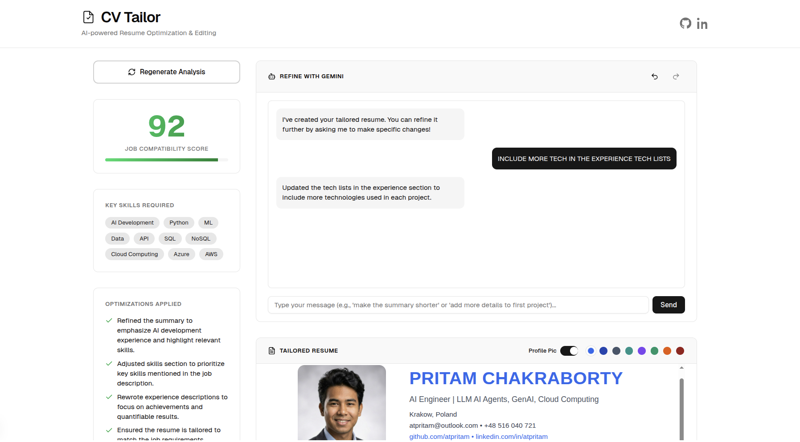

# CV Tailor App

The CV Tailor App is an AI-powered application designed to help users efficiently tailor their CVs to specific job descriptions. Leveraging advanced generative AI models and **parallel streaming processes** for lighning speed responses, the application parses resumes, analyzes job requirements, and provides intelligent, real-time suggestions to optimize a CV for a higher chance of success, ensuring a faster and more dynamic user experience.

[](https://cv-tailor-edit-app.vercel.app)

Deployed: [cv-tailor-edit-app.vercel.app](https://cv-tailor-edit-app.vercel.app/)

## Features

- **AI-Powered CV Tailoring:** Utilize Google's Generative AI to analyze job descriptions and provide targeted CV adjustments.
- **Parallel AI Streaming:** Leverages concurrent AI model calls to simultaneously generate CV analysis and tailored HTML, resulting in faster and more efficient processing.
- **Interactive AI Refinement:** Engage in a chat-based experience with the AI to continuously refine your CV, with the ability to undo and redo changes.
- **Job Compatibility Analysis:** Input job descriptions for comprehensive analysis and scoring against your CV.
- **Intelligent Suggestions:** Receive AI-driven recommendations for improving your CV content.
- **Customizable Resume Themes & Profile Photo:** Personalize your tailored resume with various color themes and an option to upload a profile photo.
- **Resume Preview:** Visualize your CV changes in real-time before saving.
- **PDF Generation & Printing:** Download your tailored CV as a PDF or print it directly.

## Technologies Used

This project is built using modern web & GenAI technologies:

- **Next.js:** A React framework for building fast web applications.
- **Google Generative AI:** For intelligent content generation and analysis.
- **TypeScript:** A typed superset of JavaScript that compiles to plain JavaScript.
- **Tailwind CSS:** A utility-first CSS framework for rapidly building custom designs.
- **pnpm:** A fast, disk space efficient package manager.

## Getting Started

Follow these instructions to set up and run the project locally.

### Prerequisites

- Node.js (version 18 or higher)
- pnpm (You can install it globally via `npm install -g pnpm`)

### Installation

1.  **Clone the repository:**

    ```bash
    git clone git@github.com:atpritam/Cv-Tailor-Edit-App.git
    cd cv-tailor-app
    ```

2.  **Install dependencies:**

    ```bash
    pnpm install
    ```

### Environment Variables

Create a `.env` file in the root of the project and add your Google Generative AI API key:

```
GEMINI_API_KEY=YOUR_GEMINI_API_KEY
BROWSERLESS_API_TOKEN=YOUR_BROWSERLESS_API_TOKEN (OFor PDF generation)
CUSTOMJS_API_KEY=YOUR_CUSTOMJS_API_KEY (For PDF generation fallback - Optional)
```

Replace `YOUR_GEMINI_API_KEY` with your actual API key obtained from Google AI Studio.
If you plan to use the PDF generation feature, you'll also need to obtain API keys for either Browserless.io or CustomJS (or both for fallback).

### Running the Development Server

To start the development server:

```bash
pnpm dev
```

Open [http://localhost:3000](http://localhost:3000) with your browser to see the result.

The application will automatically reload if you make changes to the source code.

### Building for Production

To build the application for production:

```bash
pnpm build
```

To start the production server:

```bash
pnpm start
```

## Usage

1.  **Upload your resume:** Begin by uploading your existing CV in PDF format.
2.  **Provide a job description:** Paste the job description you're targeting.
3.  **Receive tailored suggestions:** The AI will process your resume and the job description, then generate an optimized CV and produce a compatibility score.
4.  **Refine with chat (optional):** Use the interactive chat with the AI, requesting further changes to your tailored CV. Utilize the undo/redo functionality to manage revisions.
5.  **Customize appearance:** Choose from various color themes and upload a profile photo to personalize your resume's look.
6.  **Preview and export:** Review the real-time preview of your tailored and customized CV, then download it as a PDF or print it directly.

## Contributing

Contributions are welcome! Please feel free to open issues or submit pull requests.

## License

This project is licensed under the MIT License.

## Contact

For any questions or inquiries, please contact [atpritam@outlook.com](mailto:atpritam@outlook.com).
